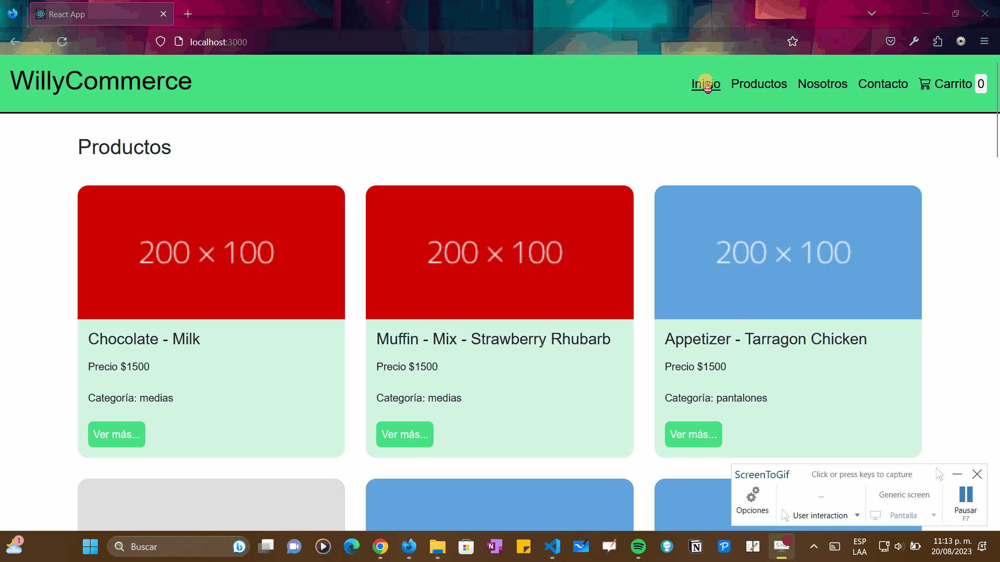

# Funcionamiento de la aplicación

# Creación del proyecto

Para la creación del proyecto es necesario crear una carpeta, abrir dicha carpeta en `Visual Studio Code` y luego digitar el comando `npx react-create-app .` este último parámetro crea todo lo necesario dentro de la carpeta ya existente.

Para ejecutarlo es necesario ejecutar el comando `npm start`

>Algunos archivos pueden y/o deben ser eliminados como :
> * `App.test.js`
> * `index.css`
> * `logo.svg`
> * `reportWebVitals.js`
> * `setupTests.js`
> 
>Estos mismos deben ser borrados de los archivos `App.js` e `index.js`.

## Inclusión del estilo
En `App.js` borrar el logo e incluir el archivo `main.css`. Adicional a ello, se debe ejecutar el comando `npm i bootstrap` e importar lo respectivo según corresponda en `index.js`. A su vez, se debe instalar `npm i bootstrap-icons`
> `import 'bootstrap/dist/css/bootstrap.css';`
> `import 'bootstrap-icons/font/bootstrap-icons.css'`

## Inclusión de SASS
Para la inclusión de SASS es necesario seguir los siguientes pasos:
1. Instalar todas las dependencias requeridas con `npm install -g node-sass`
2. Inicializar el escuchador con `npm ini`
3. Ejecutar el programa con `npm run scss`

## Sincronizar carpeta con el repositorio
Para inicializar la sincronización de los archivos con el repositorio son necesarios los siguientes pasos:
1. Inicializar git `git init`
2. Agregar todos los archivos a la sincronización `git add .`
3. Crear un comentario a los archivos nuevos `git commit -m ""`
4. Configurar el hilo donde se subirá el proyecto `git branch -M main`
5. Ejecutar la sincronización `git push -u origin main`

### Menú Dropdown
Inspirado en [Menú dropdown](https://blog.logrocket.com/how-create-multilevel-dropdown-menu-react/)

### Dependencias
Se instala la libreria `npm install react-router-dom`
Se instala la librería `npm install react-hook-form`

### Instalar administrador de Firebase
`npm install --save firebase-admin` y `npm install firebase`
# Getting Started with Create React App

This project was bootstrapped with [Create React App](https://github.com/facebook/create-react-app).

## Available Scripts

In the project directory, you can run:

### `npm start`

Runs the app in the development mode.\
Open [http://localhost:3000](http://localhost:3000) to view it in your browser.

The page will reload when you make changes.\
You may also see any lint errors in the console.

### `npm test`

Launches the test runner in the interactive watch mode.\
See the section about [running tests](https://facebook.github.io/create-react-app/docs/running-tests) for more information.

### `npm run build`

Builds the app for production to the `build` folder.\
It correctly bundles React in production mode and optimizes the build for the best performance.

The build is minified and the filenames include the hashes.\
Your app is ready to be deployed!

See the section about [deployment](https://facebook.github.io/create-react-app/docs/deployment) for more information.

### `npm run eject`

**Note: this is a one-way operation. Once you `eject`, you can't go back!**

If you aren't satisfied with the build tool and configuration choices, you can `eject` at any time. This command will remove the single build dependency from your project.

Instead, it will copy all the configuration files and the transitive dependencies (webpack, Babel, ESLint, etc) right into your project so you have full control over them. All of the commands except `eject` will still work, but they will point to the copied scripts so you can tweak them. At this point you're on your own.

You don't have to ever use `eject`. The curated feature set is suitable for small and middle deployments, and you shouldn't feel obligated to use this feature. However we understand that this tool wouldn't be useful if you couldn't customize it when you are ready for it.

## Learn More

You can learn more in the [Create React App documentation](https://facebook.github.io/create-react-app/docs/getting-started).

To learn React, check out the [React documentation](https://reactjs.org/).

### Code Splitting

This section has moved here: [https://facebook.github.io/create-react-app/docs/code-splitting](https://facebook.github.io/create-react-app/docs/code-splitting)

### Analyzing the Bundle Size

This section has moved here: [https://facebook.github.io/create-react-app/docs/analyzing-the-bundle-size](https://facebook.github.io/create-react-app/docs/analyzing-the-bundle-size)

### Making a Progressive Web App

This section has moved here: [https://facebook.github.io/create-react-app/docs/making-a-progressive-web-app](https://facebook.github.io/create-react-app/docs/making-a-progressive-web-app)

### Advanced Configuration

This section has moved here: [https://facebook.github.io/create-react-app/docs/advanced-configuration](https://facebook.github.io/create-react-app/docs/advanced-configuration)

### Deployment

This section has moved here: [https://facebook.github.io/create-react-app/docs/deployment](https://facebook.github.io/create-react-app/docs/deployment)

### `npm run build` fails to minify

This section has moved here: [https://facebook.github.io/create-react-app/docs/troubleshooting#npm-run-build-fails-to-minify](https://facebook.github.io/create-react-app/docs/troubleshooting#npm-run-build-fails-to-minify)
